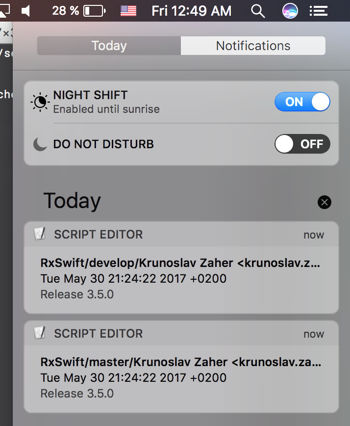

## GitWatcher (MacOS only)

Want to know when your colleagues did changes to your favorite branch? Or want to know when junior did commit without your attention? 
Then this tool is what you need.

`GitWatcher` will notify you through MacOS Notification Center (right Bar `Notification` section). Less words, just watch it yourself



### Installation

Unfortunately, it's not in public repository because of it's in testing stage yet. 

```bash
gem install bundler
git clone https://github.com/mikehouse/git_watcher.git
cd git_watcher
bundle install
gem build git_watcher.gemspec
gem install git_watcher-0.1.0.gem
```

### Usage

- Full list of commands `git_watcher -h`

- Let's say, you wanna track changes in RxSwift repository in `master` branch, then you should do this:
 
```bash
git_watcher add https://github.com/ReactiveX/RxSwift.git master
```

or you wanna see changes in `develop` too, then you can just add another one branch

```bash
git_watcher add https://github.com/ReactiveX/RxSwift.git develop
```

- To start watching changes you must schedule it, to do that you should run this:
 
```bash
git_watcher cron enable
```

will start monitoring remote branches for given repositories. It's not all, you can monitor more than one repository at the same time, just add other repositories with existed branches.

- By default `git_watcher` will check remotes every 3 minutes, you can change that to 5/10/30 or 60 minutes by

```bash
git_watcher cron 30 # set check interval to 30 minutes
```

- To disable cron timer (disable `git_watch` to check remotes), just run:

```bash
git_watcher cron disable
```

- To remove not needed branches just run:

```bash
git_watcher remove https://github.com/ReactiveX/RxSwift.git develop
```

or remove whole repository, run:

```bash
git_watcher remove https://github.com/ReactiveX/RxSwift.git
```

- To show all repositories that `git_watcher` works with, just run

```bash
git_watcher show
```

### Note

Be aware that to track changes `git_watcher` clones repositories you have provided for. It can take some disk space.
All repos cloned to `~/Library/Application Support/com.git.watcher/`

### Contributing

Bug reports and pull requests are welcome on GitHub at https://github.com/mikehouse/git_watcher.

### License

The gem is available as open source under the terms of the [MIT License](http://opensource.org/licenses/MIT).

